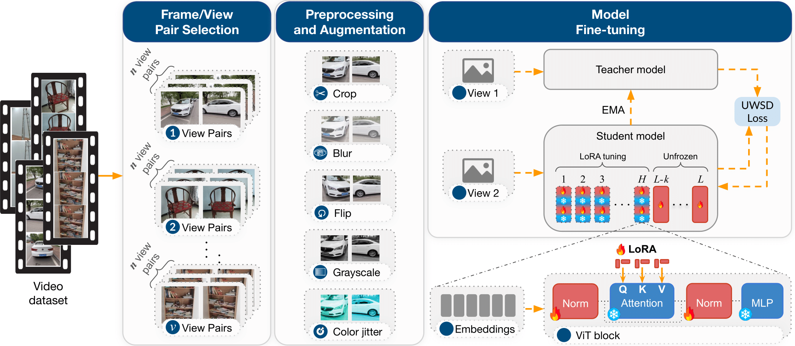

# VESSA: Video-based objEct-centric Self-Supervised Adaptation for Visual Foundation Models

[](http://arxiv.org/abs/2510.20994)


[](http://www.apache.org/licenses/LICENSE-2.0)



**VESSA** is a lightweight and effective approach for adapting **Visual Foundation Models (VFMs)** to new domains using **short, object-centric videos**.  
It leverages **self-supervised distillation** to learn robust representations **without manual labels** and with low computational overhead.

This repository provides all the components required to reproduce the experiments, including model code, environment setup, and dataset preparation scripts.

The implementation builds on **[Scenic](https://github.com/google-research/scenic)** and uses **[JAX](https://github.com/google/jax)** as the underlying framework for efficient, scalable training (CPU/GPU/TPU).

> **Status:** Accepted at **NeurIPS 2025** — The Thirty-Ninth Annual Conference on Neural Information Processing Systems.  
> **Preprint:** [📄 arXiv:2510.20994](http://arxiv.org/abs/2510.20994)

---

## Highlights

- 🔁 **Self-supervised**: no human annotations required.  
- 🎥 **Object-centric videos**: leverages multi-view and positional observations of the same object across time.  
- ⚙️ **Parameter-efficient adaptation** of VFMs (e.g., DINO/DINOv2), optionally via LoRA/adapters.  
- 📦 **Reproducible**: environment scripts, dataset builders, and training configs included.

---

## Repository Structure

- `Environment/` — environment setup scripts and instructions  
- `Datasets/` — tools and scripts to build and organize datasets  
- `images/` — figures for publication and documentation  
- `src/` — core implementation (models, data pipeline, training, evaluation)

---

## Setup

To set up your environment, please follow the instructions in:

📂 [`./Environment/`](./Environment/)

Example using conda:
```bash
conda create -n vessa python=3.10 -y
conda activate vessa
pip install --upgrade pip
pip install -r Environment/requirements.txt
```

> For GPU (CUDA) or TPU, install the appropriate JAX wheels following the official documentation and adjust `requirements.txt` accordingly.

---

## Dataset Preparation

To construct and preprocess the dataset used in this project, refer to:

📂 [`./Datasets/`](./Datasets/)

Example commands (adjust paths as needed):
```bash
# Download and organize datasets
python Datasets/download_mvimgnet.py --output /data/mvimgnet
python Datasets/prepare_co3d.py --root /data/CO3D --make-pairs

# Validate and create splits
python Datasets/make_splits.py   --root /data/mvimgnet   --strategy object-centric   --train-ratio 0.75
```

---

## Quick Start

### Training
```bash
python src/train.py   --config src/configs/vessa_vitb_mvimgnet.yaml   --data_root /data/mvimgnet   --workdir /exp/vessa_vitb_run1   --seed 42
```

### Evaluation (k-NN)
```bash
python src/eval_knn.py   --checkpoint /exp/vessa_vitb_run1/checkpoints/ckpt_last   --data_root /data/mvimgnet   --k 5
```

> Use the provided configs in `src/configs/` to reproduce the paper’s results. To switch backbones (e.g., ViT-B/16 vs ViT-S/16) or crop settings (global/local), edit the corresponding config file.

---

## Reproducibility Notes

- **File TensorFlow Datasets available**: preprocessed TensorFlow Datasets (TFDS) files were released to ensure full reproducibility of training and evaluation pipelines.  
- **Hardware**: configs include tested batch sizes, gradient accumulation, and learning-rate schedules for GPU/TPU.

---


## Citation

If you find this work useful, please consider citing:

> **VESSA: Video-based objEct-centric Self-Supervised Adaptation for Visual Foundation Models**  
> Jesimon Barreto, Carlos Caetano, André Araújo, William R. Schwartz  
> *NeurIPS 2025 — The Thirty-Ninth Annual Conference on Neural Information Processing Systems*  
> [📄 arXiv:2510.20994](http://arxiv.org/abs/2510.20994)

```bibtex
@inproceedings{barreto2025vessa,
  title     = {VESSA: Video-based objEct-centric Self-Supervised Adaptation for Visual Foundation Models},
  author    = {Barreto, Jesimon and Caetano, Carlos and Araujo, Andr{'e} and Schwartz, William R.},
  booktitle = {Proceedings of the 39th Annual Conference on Neural Information Processing Systems (NeurIPS)},
  year      = {2025},
  url       = {http://arxiv.org/abs/2510.20994}
}
```

---

## Acknowledgments

I would like to thank the *National Council for Scientific and Technological Development* — **CNPq (Grant 312565/2023-2)** and **CAPES** for their invaluable support throughout this research.  
This work also benefited from resources provided by **Google** and the **Google Cloud Platform Academic Research Grants**, which enabled large-scale experiments.

---

## License

This project is licensed under the **Apache License 2.0**.  
See **[LICENSE](./LICENSE)** or visit <http://www.apache.org/licenses/LICENSE-2.0> for details.

---

## Contact

For questions, please open an issue or contact **[Jesimon Barreto](mailto:jesimonbarreto@gmail.com)**.